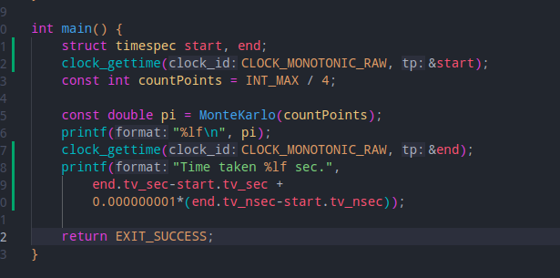
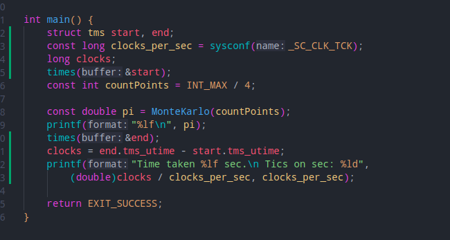

### Команды и вывод
1. time ./build/lab1 - 15,82s user 0,00s system 99% 15,847 total\
**Погрешность измерения** - 1 нс.\
**Команда для компиляции**: g++ -o ./build/lab1 lab1.c
2. clock_gettime с парметром CLOCK_MONOTONIC_RAW - 13.587008 sec., 13.773579 sec.\
**Погрешность измерения** - 1 нс.\
**Команда для кмпиляции**: g++ -o ./build/lab1 lab1.c или g++ -o ./build/lab1 lab1.c - lrt (предпочтитльно)\

3. times - 14.36 sec., 14.82 sec.\
**Погрешность измерения** - 10 мс.\
**Команда для компиляции**: g++ -o ./build/lab1 lab1.c\

### Время работы
1. Небоходимо удовлетворить относительной точности в 1%. Начальное оценочное время - 15 секунд. Тогда абсолютная точность = 15 * 0.01 = 0.15 секунд.
2. Для 1 способа измерения абсолютная точность равна (15.847 +- 10^-9) * 0.01 = 0.15847 +- 10^-11 секунд. Разница больше заявленной, следовательно продолжаем измерения.
3. Вторым способом мы измеряем время работы необходимой подпрограммы. Абсолютная точность = (13.587008 +- 10^-9) * 0.01 = 0.13587008 +- 10^-11 секунд. Точноть выше требуемой, следовательно такой способ измерения подходит.
4. Третий способ также измеряет время работы подпрограммы, однако с большей погрешностью. Абсолютная точность = (14.36 +- 10^-2) * 0.01 = 0.1436 +- 10^-4 секунд. Точноть выше требуемой, следовательно такой способ измерения подходит.\
**Вывод**: наиболее предпочтительным оказался таймер номер 2. 