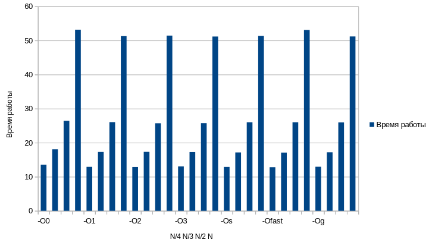

### Команды компиляции, время работы(замерено с помощью утилиты times) и размер исполняемого файла
1. #### N = INT_MAX/4:
    1. gcc -O0 lab2.c -o ./build/lab2 -Wall:\
    **Время работы** = [13.72, 15.21, 14.49, 14.24, 14.10, 13.61, **13.52**, 14.18, 15.79, 14.04]\
    **Размер** - 15536 Б
    2. gcc -O1 lab2.c -o ./build/lab2 -Wall:\
    **Время работы** = [13.00, 13.29, 13.34, 12.96, 13.28, 12.94, 13.28, 13.60, 13.31, **12.91**]\
    **Размер** - 15536 Б
    3. gcc -O2 lab2.c -o ./build/lab2 -Wall:\
    **Время работы** = [13.13, 13.30, 13.30, **12.87**, 13.31, 13.46, 13.39, 13.05, 13.31, 13.27]\
    **Размер** - 15536 Б
    4. gcc -O3 lab2.c -o ./build/lab2 -Wall:\
    **Время работы** = [13.38, 13.27, 13.27, 13.27, **13.02**, 13.28, 13.45, 13.29, 13.31, 13.46]\
    **Размер** - 15536 Б
    5. gcc -Os lab2.c -o ./build/lab2 -Wall:\
    **Время работы** = [13.20, 13.90, 13.45, 13.31, 13.28, 13.27, **12.89**, 12.91, 13.30, 13.27]\
    **Размер** - 15536 Б
    6. gcc -Ofast lab2.c -o ./build/lab2 -Wall:\
    **Время работы** = [13.39, 12.89, 13.31, 12.82, 13.27, 13.29, 13.28, **12.81**, 13.28, 13.06]\
    **Размер** - 15536 Б
    7. gcc -Og lab2.c -o ./build/lab2 -Wall:\
    **Время работы** = [13.60, 13.29, 13.29, 13.57, 13.01, 13.29, 13.31, **12.93**, 13.35, 13.29]\
    **Размер** - 15536 Б\
    *Минимальное время*: **12.81** сек. при оптимизации **-Ofast**
2. #### N = INT_MAX/3:
    1. gcc -O0 lab2.c -o ./build/lab2 -Wall:\
    **Время работы** = [19.34, **18.05**, 18.37, 18.19, 18.31, 18.17, 19.20, 18.16, 19.23, 19.11]\
    **Размер** - 15536 Б
    2. gcc -O1 lab2.c -o ./build/lab2 -Wall:\
    **Время работы** = [17.57, 18.54, 17.70, 17.75, 18.30, 18.29, **17.27**, 17.74, 18.29, 17.80]\
    **Размер** - 15536 Б
    3. gcc -O2 lab2.c -o ./build/lab2 -Wall:\
    **Время работы** = [17.74, 18.26, 17.74, **17.30**, 17.74, 18.28, 18.30, 17.71, 18.29, 18.30]\
    **Размер** - 15536 Б
    4. gcc -O3 lab2.c -o ./build/lab2 -Wall:\
    **Время работы** = [18.05, 18.31, 17.70, 18.30, 17.76, **17.23**, 18.30, 19.08, 17.50, 18.28]\
    **Размер** - 15536 Б
    5. gcc -Os lab2.c -o ./build/lab2 -Wall:\
    **Время работы** = [17.50, 18.29, 18.30, 17.26, 17.48, 17.52, 17.76, 17.73, 18.26, **17.13**]\
    **Размер** - 15536 Б
    6. gcc -Ofast lab2.c -o ./build/lab2 -Wall:\
    **Время работы** = [18.19, 18.23, 18.10, 18.21, 17.74, 18.13, 18.07, 18.02, **17.09**, 18.20]\
    **Размер** - 15536 Б
    7. gcc -Og lab2.c -o ./build/lab2 -Wall:\
    **Время работы** = [17.21, 17.19, 22.95, 17.72, 18.27, 18.50, 17.75, 17.70, 17.70, **17.17**]\
    **Размер** - 15536 Б\
    *Минимальное время*: **17.09** сек. при оптимизации **-Ofast**
3. #### N = INT_MAX/2:
    1. gcc -O0 lab2.c -o ./build/lab2 -Wall:\
    **Время работы** = [28.58, 27.19, 26.64, 27.15, 28.14, 27.24, 28.24, **26.41**, 27.17, 27.17]\
    **Размер** - 15536 Б
    2. gcc -O1 lab2.c -o ./build/lab2 -Wall:\
    **Время работы** = [27.23, 27.07, 26.56, 26.90, 26.62, 26.70, 26.58, 26.60, 26.56, **26.03**]\
    **Размер** - 15536 Б
    3. gcc -O2 lab2.c -o ./build/lab2 -Wall:\
    **Время работы** = [25.78, 26.57, 26.55, 26.56, 26.79, 26.74, 33.39, 25.78, 25.66, **25.70**]\
    **Размер** - 15536 Б
    4. gcc -O3 lab2.c -o ./build/lab2 -Wall:\
    **Время работы** = [28.06, 26.98, 26.88, 25.79, 26.94, 26.55, 26.83, **25.73**, 25.73, 25.94]\
    **Размер** - 15536 Б
    5. gcc -Os lab2.c -o ./build/lab2 -Wall:\
    **Время работы** = [26.49, 26.02, **25.99**, 27.16, 26.89, 26.74, 25.99, 26.66, 26.58, 27.32]\
    **Размер** - 15536 Б
    6. gcc -Ofast lab2.c -o ./build/lab2 -Wall:\
    **Время работы** = [26.49, 26.03, **25.81**, 27.12, 26.70, 26.74, 25.81, 26.66, 26.34, 27.05]\
    **Размер** - 15536 Б
    7. gcc -Og lab2.c -o ./build/lab2 -Wall:\
    **Время работы** = [27.51, **25.94**, 26.24, 27.18, 27.27, 26.06, 26.56, 26.57, 26.58, 26.64]\
    **Размер** - 15536 Б\
    *Минимальное время*: **25.70** сек. при оптимизации **-O2**
3. #### N = INT_MAX:
    1. gcc -O0 lab2.c -o ./build/lab2 -Wall:\
    **Время работы** = [57.52, 54.41, 56.13, 54.31, 54.42, 54.31, 55.96, 54.42, **53.16**, 54.33]\
    **Размер** - 15536 Б
    2. gcc -O1 lab2.c -o ./build/lab2 -Wall:\
    **Время работы** = [53.19, 53.11, 53.11, 51.89, 53.10, 51.45, 53.12, 51.40, **51.27**, 53.11]\
    **Размер** - 15536 Б
    3. gcc -O2 lab2.c -o ./build/lab2 -Wall:\
    **Время работы** = [53.11, 53.22, 53.19, **51.43**, 53.10, 53.42, 53.09, 53.09, 51.49, 53.11]\
    **Размер** - 15536 Б
    4. gcc -O3 lab2.c -o ./build/lab2 -Wall:\
    **Время работы** = [53.15, 53.10, 53.19, 53.89, 53.17, 51.30, 53.10, 53.98, 51.51, **51.16**]\
    **Размер** - 15536 Б
    5. gcc -Os lab2.c -o ./build/lab2 -Wall:\
    **Время работы** = [53.10, 53.62, **51.32**, 53.10, 53.09, 53.98, 53.22, 51.38, 53.11, 51.38]\
    **Размер** - 15536 Б
    6. gcc -Ofast lab2.c -o ./build/lab2 -Wall:\
    **Время работы** = [53.15, 53.09, 53.53, 53.10, **53.09**, 53.20, 53.14, 53.10, 53.10, 53.44]\
    **Размер** - 15536 Б
    7. gcc -Og lab2.c -o ./build/lab2 -Wall:\
    **Время работы** = [51.48, 51.63, 51.44, 53.02, 53.58, 51.24, **51.18**, 52.86, 51.55, 53.22]\
    **Размер** - 15536 Б\
    *Минимальное время*: **51.16** сек. при оптимизации **-O3**
### Вывод
Наилучшее время работы для небольших значений (< INT_MAX/2) программа показала при опитимизации **-Ofast**. Для больших значений (>= INT_MAX/2)\
лучшее время было достигнуто при оптимиазациях **-O2/-O3**.

### Приложения
